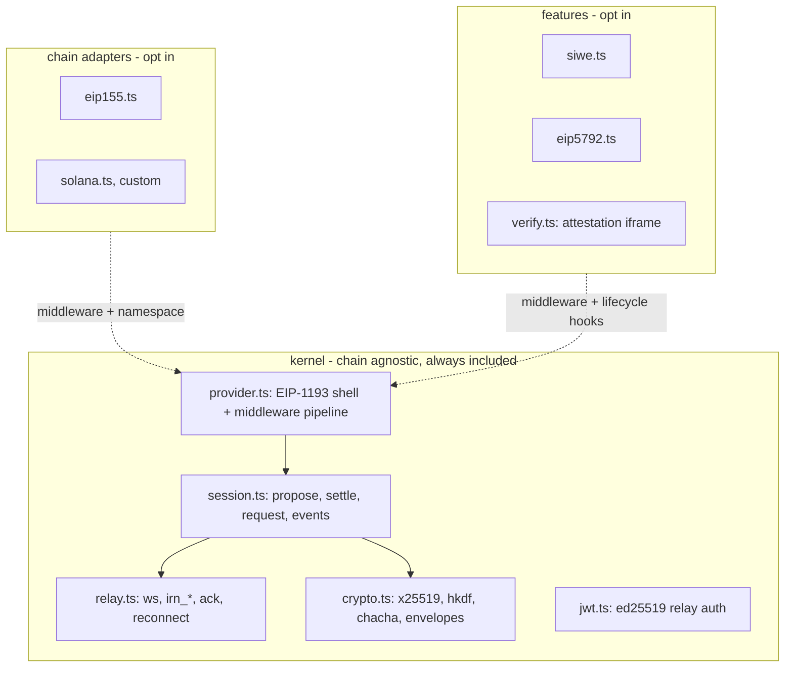

# Minimal WalletConnect EVM Provider

A from-scratch, browser-only TypeScript reimplementation of the WalletConnect v2 dapp client
with zero `@walletconnect` runtime dependencies: a ~900-line CAIP-agnostic kernel (relay socket,
crypto, session handshake) plus pluggable chain adapters and feature plugins, shipped as
per-module ESM with subpath exports so unused chains and features vanish at build time.

Reference implementation studied: `~/Dev/titan/walletconnect-monorepo` at SDK 2.23.10.

## Why this is possible

The current stack is ~17k lines across five packages (`core` 4.5k, `sign-client` 4.4k,
`utils` 3.3k, `types` 2.1k, `universal-provider` 1.8k, `ethereum-provider` 1.2k) and a 1.3 MB
UMD bundle. The actual dapp-side protocol is small:

- Three relay JSON-RPC methods: `irn_publish`, `irn_subscribe`, and inbound `irn_subscription`
  (which must be acked with `result: true`, since delivery is at-least-once).
- One AEAD envelope: `0x00 || iv(12) || chacha20poly1305(symKey, iv, utf8(json))`, base64 **padded**.
- Two key derivations: `topic = sha256(symKeyBytes)`, and
  `sessionSymKey = HKDF-SHA256(x25519(selfPriv, peerPub), salt=undefined, info=undefined, 32)`.
- One handshake: `wc_sessionPropose` -> propose response carrying `responderPublicKey` ->
  derive session topic -> subscribe -> inbound `wc_sessionSettle` -> ack.
- One request frame: `wc_sessionRequest` with `{ request: { method, params, expiryTimestamp }, chainId }`,
  matched by inner JSON-RPC id.

Everything else in `core`/`sign-client` is wallet-side logic, telemetry (`eventClient`, TVF),
push (`echo`), analytics, persistent history/expirer stores, batch RPCs, link mode, and the
pairing controller. All droppable for a dapp.

Non-goals: React Native, link mode, type-2 envelopes, wallet-side APIs
(`approve`/`reject`/`respond`), CJS output.

## Architecture



Composition, not inheritance. No god-class: the provider is a factory returning an object literal
whose behaviour comes from a middleware chain assembled out of exactly the adapters and features
you passed.

## Public API

Native entry, `src/index.ts`:

```ts
import { createProvider } from "konekt";
import { evm } from "konekt/eip155";
import { solana } from "konekt/solana";
import { bitcoin } from "konekt/bip122";
import { siwe } from "konekt/siwe";

const provider = await createProvider({
  projectId,
  metadata,
  chains: [evm(1, 8453), solana, bitcoin],
  features: [siwe({ domain: location.host })],
});

provider.on("display_uri", (uri) => renderMyQrCode(uri)); // UI is entirely the app's business
await provider.connect({ signal: abortController.signal });
const sig = await provider.request({ method: "personal_sign", params: [msg, addr] });
```

A flat list. The user never groups by CAIP namespace; the kernel does, because every chain knows
its own:

```ts
export const solana  = { namespace: "solana", id: "solana:5eykt4...", adapter: solanaAdapter };
export const evm = (...ids) => ids.map((id) => ({
  namespace: "eip155", id: `eip155:${id}`, adapter: evmAdapter,
}));
```

Chains must be enumerated: a namespace entry with no CAIP-2 chain is rejected with
`UNSUPPORTED_CHAINS` (`utils/src/validators.ts:147`), since the wallet has to know which chains to
return accounts for.

Testnets are just other references. EVM uses a factory because there are thousands of chains and
the reference is a number; Solana and Bitcoin use named constants because the reference is an
opaque genesis-hash fragment nobody should type from memory, with a factory as the escape hatch:

```ts
import { evm } from "konekt/eip155";
import { solanaDevnet, solanaChain } from "konekt/solana";
import { bitcoinTestnet } from "konekt/bip122";

chains: [evm(11155111), bitcoinTestnet, solanaDevnet]
chains: [solanaChain("EtWTRABZaYq6iMfeYKouRu166VU2xqa1")]   // anything unlisted
```

Every CAIP-2 reference we hardcode (`solana:5eykt4...`, `bip122:000000000019d668...`, and the
testnets) must be verified against the current CAIP registries when written, not taken from
memory. Bitcoin especially: testnet3, testnet4 and signet have different genesis hashes and
wallets disagree about which one "testnet" means.

There are deliberately **no named chain constants** (`mainnet`, `base`, ...). viem ships those
because it renders names, native currencies and explorer links; we ship no UI, so a chain is a
CAIP-2 id and nothing else. A chain registry would be weight and maintenance for no benefit.
`evm()` is variadic and returns a `Chain[]` that the kernel flattens, so adding an L2 is adding a
number.

The adapter reference lives on the chain rather than in a namespace-keyed registry precisely to
keep tree shaking: importing `evm` pulls in the EVM adapter, importing `bitcoin` pulls in the
Bitcoin one, whereas a lookup table would pull in all of them. `createProvider` groups the flat
list by `namespace` and instantiates each distinct adapter once.

### Sessionless / QR-per-signature

The proposal's `requests` field accepts only `authentication` and `walletPay`
(`types/src/sign-client/proposal.ts:41`, both experimental), so a QR can carry a SIWE request but
never an arbitrary `personal_sign` or `eth_sendTransaction`. Two consequences:

- Login by QR is a single scan and a single wallet prompt, with the signed CACAO returned inside
  `wc_sessionSettle`. That is exactly what the `siwe` feature does; no session request needed.
- Arbitrary signing needs a settled session first. It can still be one-shot: fresh pairing URI per
  signature, connect, request, disconnect. Costs two wallet prompts, a handshake before the
  request, five-minute URI expiry, and a rescan every time — worse on mobile, where there is no
  live session to deep-link into.

No special mode is needed, because sessions are durable only by virtue of being persisted and the
reusable-pairing machinery is already gone:

```ts
const provider = await createProvider({ projectId, chains: [evm(1)], storage: null });
provider.on("display_uri", showQr);
await provider.connect();
const sig = await provider.request({ method: "personal_sign", params: [msg, addr] });
await provider.disconnect();
```

`storage: null` gives an in-memory keychain, so nothing survives the page and every `connect()`
mints a fresh pairing. Document this as a supported pattern for kiosks, shared machines, and
anywhere a persistent session is a liability.

### Reads are opt-in

In a wagmi or viem app the reads never reach this provider: the public client has its own `http()`
transport, and we are only the wallet transport for `eth_sendTransaction`, `personal_sign`,
`eth_accounts`, `eth_chainId` and `wallet_switchEthereumChain`. Configuring an RPC URL here would
duplicate what is already in `createConfig`. The HTTP fallback only earns its place when the
provider is used standalone — `new ethers.BrowserProvider(provider)` with nothing else configured
really does send `eth_call` down the EIP-1193 pipe — which is why upstream bakes it in and why the
compat entry keeps it.

```ts
chains: [evm(1, 8453), solana, bitcoin]                          // signer only, no rpc anywhere
chains: [evm(1, { read: http("https://mainnet.base.org") })]     // standalone
```

Without `read`, a method outside the approved session rejects with `4200 Unsupported method`
rather than being silently proxied. Three consequences: the HTTP JSON-RPC client is its own module
so not importing `http` shakes it out; the default config surface for a wagmi app is a list of
chain ids; and nothing is silently proxied to `rpc.walletconnect.org`, which today means user
`eth_call` traffic reaches WalletConnect infrastructure by default.

The Solana and Bitcoin adapters forward everything to the wallet and take no configuration at all.

`provider` is EIP-1193: `request`, `on`/`once`/`off`/`removeListener`, `enable`, `connect`,
`disconnect`, `session`, `connected`, `isWalletConnect`, plus whatever the adapters merge in
(`chainId`, `accounts` from the EVM adapter). Extensions are typed by inferring over the `chains`
tuple, so `provider.chainId` is `number` when an EVM chain is present and absent otherwise.

No UI, ever. The library's entire connection surface is the `display_uri` event (also available
as `provider.uri`) and an `AbortSignal` on `connect()` for when the user dismisses whatever the
app rendered. There is no `@reown/appkit` dependency, optional or otherwise, and no modal object
contract to satisfy.

### Why a compat entry exists at all

The provider object is EIP-1193-compatible by construction, so ethers and viem need no shim. What
is not inherent is the *package* API — a static factory plus non-standard properties — and wagmi's
connector depends on all of it:

```ts
const { EthereumProvider } = await import("@walletconnect/ethereum-provider");
await EthereumProvider.init({ ...parameters, disableProviderPing: true, optionalChains,
                              projectId, rpcMap, showQrModal: parameters.showQrModal ?? true });
```

then `provider.session`, `provider.accounts`, `provider.chainId` (decimal number, returned straight
from `getChainId()`), `provider.connect({ optionalChains })`, `provider.enable()`,
`provider.disconnect()`, and `provider.events.setMaxListeners(Infinity)`.

`src/compat/ethereum-provider.ts` therefore reproduces `EthereumProvider.init(...)`, those four
properties, an `events` object exposing `setMaxListeners` as a no-op, and re-exports
`REQUIRED_METHODS` / `OPTIONAL_METHODS` / `REQUIRED_EVENTS` / `OPTIONAL_EVENTS` with byte-identical
arrays (order matters; upstream tests deep-equal them). Reads are always enabled here, matching
upstream. The point is that aliasing `@walletconnect/ethereum-provider` to `konekt/ethereum-provider`
in the bundler leaves wagmi, RainbowKit and ConnectKit untouched.

`showQrModal` defaults to `true` in wagmi's connector, so a naive alias hits our throw immediately.
The error must name the fix: pass `walletConnect({ projectId, showQrModal: false })` and render
`display_uri` yourself, which is what RainbowKit and ConnectKit already do. `qrModalOptions` is
accepted and ignored so call sites keep compiling.

Apps that control their own call sites should import `createProvider` instead and never pull these
130 lines into the bundle.

### wagmi 3

The connector quoted above is wagmi 3 (`wagmi@3.7.6`, `@wagmi/connectors@8.1.0`), so that is the
compatibility target. Two supported routes:

1. **Alias.** `resolve.alias: { "@walletconnect/ethereum-provider": "konekt/ethereum-provider" }`,
   keep wagmi's `walletConnect()`, pass `showQrModal: false`. No connector code from us. Costs the
   compat shim, plus a duplicated `rpcMap` that wagmi derives from `config.transports` and that our
   provider does not need.
2. **`konekt/wagmi`** — our own connector on `createProvider`, ~200 LOC against wagmi's 377. No
   compat shim, no legacy quirks, reads stay off, and our options surface directly (`chains`,
   `features`, `storage`). Keep `id: 'walletConnect'` so persisted `wagmi.recentConnectorId` state
   still matches and it drops in for `walletConnect()`.

wagmi already forwards `display_uri` as a wagmi `message` event, so QR rendering is the app's job
there regardless — the no-modal stance costs nothing. The non-WalletConnect parts to budget for are
`isChainsStale` / `getRequestedChainsIds` bookkeeping in `config.storage`, and `switchChain` racing
a `config.emitter` `change` listener against the RPC call with a `wallet_addEthereumChain` fallback.
`@wagmi/core` stays a peer dependency, types only where possible.

## Plugin contracts

```ts
export type Middleware = (
  req: { method: string; params?: unknown; chainId: string },
  next: (req: { method: string; params?: unknown; chainId: string }) => Promise<unknown>,
) => Promise<unknown>;

export interface Chain {
  namespace: string;                 // "eip155"
  id: string;                        // CAIP-2, "eip155:1"
  adapter: ChainAdapter;
  read?: (req: RequestArguments) => Promise<unknown>;  // opt-in, EVM only
}

export interface ChainAdapter<Ext = {}> {
  namespace: string;                 // "eip155"
  methods: string[];                 // defaults proposed for this namespace
  events: string[];
  middleware?: Middleware;           // local answers, HTTP fallback, method gating
  extend?(ctx: Ctx): Ext;            // provider.chainId, provider.accounts
  onSettle?(session: Session, ctx: Ctx): void;
  onEvent?(name: string, data: unknown, chainId: string, ctx: Ctx): void;
}

export interface Feature {
  name: string;
  // Awaited before the proposal is published, so it can fetch a nonce.
  onProposal?(p: Proposal): Proposal | undefined | Promise<Proposal | undefined>;
  // Throwing rejects connect() and tears the session down.
  onSettle?(s: Session): void | Promise<void>;
  onDisconnect?(): void;
}
```

Three hooks, all optional, none of them able to render anything. `middleware` was dropped: features
do not wrap `request()`, which is why `eip5792` cannot be one — see below.

The seam is symmetric. A feature writes its own key under `Proposal.requests` and reads the matching
key back off `Session.proposalRequestsResponses`; the kernel carries both containers without reading
either. That is what makes a feature addable without a kernel change.

### Which features exist

| Feature | LOC | Purpose |
| --- | --- | --- |
| `siwe` | ~110 | adds `requests.authentication` to the proposal and binds the returned CACAOs to the session |
| `verify` | ~40 | attestation iframe, so wallets show the domain as verified |

`konekt/cacao` (~170) is not a feature. It formats the CAIP-122 message and verifies CACAO
signatures, and it is meant to run on the server that trusts the answer, so it depends on nothing.

`eip5792` is **not** a feature and cannot be one under this contract: it is entirely `request()`
methods (`wallet_sendCalls`, `wallet_getCallsStatus`, `wallet_getCapabilities`), and features do not
wrap `request()`. It belongs on the EVM adapter's method routing. Unresolved.

In the kernel rather than features, because everything needs them: session persistence and
restore, socket reconnect on visibility/online changes, inbound dedupe, EIP-1193 event emission,
request expiry.

Left as plain options rather than features, because each is a few lines and the app supplies the
policy:

- `onRequestSent({ id, topic })` — override for the wallet redirect; see below.
- `onDebug(event)` — kernel-internal observability: `socket_open`, `socket_close` with the close
  code, `publish`, `inbound`, `settle`, `error`. Request-level tracing already falls out of the
  middleware chain, so this covers only what middleware cannot see. Nothing is emitted or retained
  when unset; point it at Sentry or OpenTelemetry in a few lines.

Deliberately absent, not pluggable: the modal, `eventClient` analytics, echo push registration,
TVF hash extraction, link mode, the persistent history and expirer stores, the pairing controller,
batch relay RPCs. That list is most of the difference between 17k lines and 1.3k.

Vendor analytics is dropped rather than made optional on purpose. `eventClient` (233 lines) posts
traces to a WalletConnect endpoint, and TVF attaches users' `txHashes` and `contractAddresses` to
relay publish params. A feature implies someone might reasonably enable it, and the metrics belong
to WalletConnect rather than to you, so it would be dead code with a maintenance cost. Observability
is a separate concern and is served by `onDebug` above. The `ua` query param on the socket stays,
since the relay may use it for compatibility and it is a static string.

Conditional fourth feature: `konekt/siwe/legacy` for the deprecated `wc_sessionAuthenticate` flow,
built only if a spike shows wallet support for the modern path is too thin. It needs a second
keypair, a hashed response topic, type-1 envelope decoding and recap-to-namespace synthesis, so it
roughly doubles the SIWE code.

## The EVM adapter

Chains are grouped into one `eip155` namespace entry in the proposal, carrying the union of the
adapter's default `methods` and `events`. The escape hatch for overriding those lists is the
adapter factory, which is not needed in ordinary use:

```ts
chains: [mainnet, base],
adapters: [eip155({ methods: [...OPTIONAL_METHODS, "eth_myCustomMethod"] })],
```

`chains` is a request, not a guarantee. Required namespaces are dead in the current protocol —
`connect()` merges them into optional and sends `requiredNamespaces: {}`
(`sign-client/src/controllers/engine.ts:229`) — so the wallet may approve a subset, or chains
that were never asked for. The adapter reads the truth from the settled session's `accounts`.

Request routing, which is where the adapter earns its ~160 lines:

| Method | Destination |
| --- | --- |
| `eth_accounts`, `eth_requestAccounts`, `eth_chainId` | answered locally from the session, no round trip |
| `wallet_switchEthereumChain` | local when the chain is already approved, else the wallet |
| `personal_sign`, `eth_sendTransaction`, `eth_signTransaction`, `eth_signTypedData_v4` | the wallet, via `wc_sessionRequest` |
| everything else (`eth_call`, `eth_getBalance`, `eth_estimateGas`, ...) | the chain's `read` transport, or `4200 Unsupported method` when none is configured |

Signing crosses the encrypted session; reads, when enabled at all, go straight to an RPC node, so
the wallet never sees an `eth_call`.

The adapter merges `chainId` and `accounts` onto the provider, which is why those properties are
typed as present only when it is configured.

## Non-EVM

An adapter is ~50 lines when it has no local-answer logic: declare `namespace`, `methods` and
`events`, export a few named chain constants, and let every method fall through to
`wc_sessionRequest`. That is all `solana` and `bip122` are. The EVM adapter is the fat one only
because of the routing table above. Their exact method lists (`solana_signTransaction`,
`solana_signMessage`, `solana_signAndSendTransaction`; `sendTransfer`, `signMessage`, `signPsbt`,
`getAccountAddresses`) need verifying against the current CAIP specs when written.

## Tree shaking

- ESM only, `"type": "module"`, `"sideEffects": false`, `tsc` with preserved module structure
  (no bundling) so bundlers see one module per unit.
- Subpath `exports`: `.`, `./eip155`, `./solana`, `./bip122`, `./siwe`, `./eip5792`, `./verify`,
  `./wagmi`, `./ethereum-provider`. No barrel that transitively imports chains or features.
- No `events` polyfill; a ~30-line typed emitter.
- Only `@noble/ciphers`, `@noble/curves`, `@noble/hashes` at runtime, imported by exact
  submodule path.
- `size-limit` budgets in CI: kernel + `eip155` <= 15 kB gz, each feature <= 3 kB gz.
- `publint` + `attw` in CI so the exports map and types stay honest.

## Protocol constants to hardcode

Tags and TTLs from `packages/sign-client/src/constants/engine.ts`. These drive relay push
routing, so wrong values mean backgrounded mobile wallets never wake.

| Method | Request tag | TTL (s) | Prompt | Response tag |
| --- | --- | --- | --- | --- |
| `wc_sessionPropose` | 1100 | 300 | yes | 1101 (reject 1120) |
| `wc_sessionSettle` | 1102 | 300 | no | 1103 (dapp must publish this ack) |
| `wc_sessionRequest` | 1108 | 900 | yes | 1109 |
| `wc_sessionEvent` | 1110 | 300 | yes | receive only, no ack |
| `wc_sessionUpdate` | 1104 | 86400 | no | 1105 |
| `wc_sessionExtend` | 1106 | 86400 | no | 1107 |
| `wc_sessionDelete` | 1112 | 86400 | no | no ack |
| `wc_sessionPing` | 1114 | 86400 | no | 1115 |

Relay socket:
`wss://relay.walletconnect.org?auth=<EdDSA JWT>&projectId=...&ua=...&useOnCloseEvent=true`.
JWT claims in order `iss, sub, aud, iat, exp`, `iss = did:key:z<base58btc(0xed01||pubkey)>`,
`aud` = relay URL, ttl 86400, seed persisted (it also derives
`subscriptionId = sha256(topic + clientId)` used by unsubscribe). Close code 3000 is fatal, not
retryable.

Persist only two things: the keychain (ed25519 seed, `topic -> symKey`) and the session record.
Everything else is reconstructible.

## File layout (~1.3k LOC total)

| File | LOC | Responsibility |
| --- | --- | --- |
| `src/kernel/crypto.ts` | ~90 | keypairs, HKDF, envelopes, topic hashing |
| `src/kernel/jwt.ts` | ~40 | ed25519 relay auth token |
| `src/kernel/relay.ts` | ~180 | socket, publish/subscribe, ack, dedupe, visibility/online reconnect |
| `src/kernel/session.ts` | ~250 | pairing URI, propose/settle/ack, requests, inbound events, persistence |
| `src/kernel/provider.ts` | ~120 | EIP-1193 shell, middleware composition, hook dispatch |
| `src/kernel/storage.ts` | ~35 | pluggable kv, localStorage default |
| `src/kernel/emitter.ts` | ~30 | typed emitter |
| `src/kernel/uri.ts` | ~25 | `wc:` URI format/parse |
| `src/chains/eip155.ts` | ~140 | EVM adapter + `evm(...ids)` |
| `src/http.ts` | ~40 | opt-in HTTP JSON-RPC read transport |
| `src/chains/solana.ts` | ~50 | forward-everything adapter + `solana` |
| `src/chains/bip122.ts` | ~50 | forward-everything adapter + `bitcoin` |
| `src/features/siwe.ts` | ~120 | proposal-embedded auth + CACAO verification |
| `src/features/eip5792.ts` | ~110 | call batching, capabilities |
| `src/features/verify.ts` | ~40 | attestation iframe |
| `src/compat/ethereum-provider.ts` | ~130 | drop-in-ish legacy facade |
| `src/wagmi.ts` | ~200 | native wagmi 3 connector, no compat shim |

## Testing

1. Crypto/JWT parity: vectors cross-checked against `@walletconnect/utils` and
   `@walletconnect/relay-auth` as devDependencies (encrypt/decrypt round-trip, `hashKey`,
   `deriveSymKey`, `did:key` encoding).
2. Interop against a local relay: a ~100-line `ws` server implementing
   `irn_publish`/`irn_subscribe`/`irn_subscription`, with the real `@walletconnect/sign-client`
   as the wallet peer. Covers the full handshake, `personal_sign`, `eth_sendTransaction`,
   `chainChanged`/`accountsChanged`, `wc_sessionDelete`, and restore-after-reload. Deterministic,
   no projectId, runs in CI.
3. Consumer smoke tests: `new ethers.BrowserProvider(provider)` and `new Web3(provider)` against
   a Hardhat node, mirroring the existing suite's contracts.
4. Live relay smoke test gated on a `WC_PROJECT_ID` env var, skipped when absent.

## Risks and deliberate deviations

- **`wc_proposeSession`**: since 2.21.7 the SDK publishes the proposal through a composite relay
  method (`{ pairingTopic, sessionProposal, ttl }`, no `tag`, no `prompt`) that implicitly
  subscribes the caller, so `connect()` passes `internal: { skipSubscribe: true }`. It is not
  harder to implement — it is one frame instead of two — but we default to the older explicit
  `irn_subscribe` + `irn_publish(tag 1100)` path for three reasons: the implicit subscribe is an
  undocumented server-side contract that would fail as a silent hang if it differs in any detail;
  `irn_publish` must keep working indefinitely for pre-2.21.7 dapps, whereas `wc_proposeSession`
  only exists on new enough relays (including our CI test relay, where emulating it would prove
  nothing); and we need `irn_subscribe`/`irn_publish` anyway for the session topic and every
  request, so reusing them costs no new code while `wc_proposeSession` adds a second publish
  shape. The only thing it buys is one saved round trip during QR scanning. The live-relay spike
  should confirm the legacy path still settles and, separately, whether `wc_proposeSession`
  behaves as assumed, so it can be enabled later behind a flag.
- **Verify attestation dropped by default**: wallets will show the dapp origin as unverified,
  which some render as a warning. Mitigated by the optional `verify()` feature (hidden iframe
  against `verify.walletconnect.org/v3/attestation`, ~40 lines).
- **Link mode stays out, even for browsers.** Two mechanisms get called deep links. The shipping
  one keeps the relay for data and uses `${walletHref}/wc?requestId=${id}&sessionTopic=${topic}`
  purely to foreground the wallet — no payload in the URL, the wallet fetches it from the relay.
  True link mode (`?wc_ev=<envelope>&topic=<topic>`, no socket) is gated on `isReactNative()` for
  good reasons: the return path is a full page navigation, so every pending request must survive
  an unload; type-2 envelopes are plaintext and unauthenticated, safe only because the OS enforces
  universal-link association, which a browser cannot provide — anyone can navigate you to
  `?wc_ev=...`, and the response leaks into history, referrer and server logs; and desktop has no
  deep links at all, so the relay path is needed regardless. Encrypting link payloads as type 0
  with the session symKey would fix the authenticity hole, but no wallet speaks that dialect.
  Note the return address is not the missing piece: it already travels in
  `metadata.redirect.universal` at handshake time, so a browser dapp could advertise its own https
  URL and the wallet would reply there (subject to being in the wallet's `linkModeSupportedApps`
  registry, which still requires a relay-based first contact).

  If revisited, the viable shape is **verified-response link mode**: accept link input only as a
  response to a pending request, only for methods with a registered verifier, and route everything
  else over the relay. `personal_sign` and `eth_signTypedData_v4` results are self-authenticating
  via `ecrecover` against the session account, and `eth_signTransaction` via sender recovery from
  the signed RLP — a forged response just fails, so transport trust stops mattering. Two things
  resist it: `eth_sendTransaction` returns a bare hash bound to nothing, verifiable only by
  fetching it and racing propagation; and the channel also carries `wc_sessionSettle` and
  `wc_sessionEvent`, which have no self-authenticating property at all, where a forged
  `accountsChanged` naming an attacker address is the worst case in the whole design. Cost is a
  second transport, a verifier registry, secp256k1 + keccak (~8-10 kB gz, not otherwise needed),
  and persisting pending requests across a page unload — in exchange for skipping one socket round
  trip on mobile. Needs a measured latency win to justify.
- **Wallet redirects come from peer metadata, not a registry.** On mobile the wallet must be
  re-foregrounded for every signature. Upstream reads the wallet link from a
  `WALLETCONNECT_DEEPLINK_CHOICE` localStorage entry recording which wallet the user tapped in
  AppKit's list — a registry dependency, and wrong when the user taps one wallet and connects with
  another. We use `session.peer.metadata.redirect` (`native`, `universal`), which the wallet itself
  publishes at settle, so there is no per-wallet code anywhere: append
  `/wc?requestId=${id}&sessionTopic=${topic}` and open it. On by default, ~15 lines, with the
  guards upstream learned the hard way — honour `sessionConfig.disableDeepLink`, skip when
  `document.hasFocus()` is false, special-case Telegram's `startapp`. `redirect: false` disables
  it; `onRequestSent` overrides it. When a wallet publishes no `redirect`, there is none and the
  user switches apps manually.

  A wallet registry is only needed *before* a session exists, to render "Open in MetaMask /
  Rainbow" buttons so a phone user need not scan a QR shown on that same phone. That is a wallet
  picker: UI, brand icons, the app's job. Apps wanting it can source the list from the
  WalletConnect Explorer API.
- **`eth_chainId` returns hex**, not the number the original returns. Spec-correct, and both
  `parseInt` and `Number` handle it, but it is a documented behaviour change.
- **SIWE**: implement the modern flow (authentication embedded in the proposal as
  `requests.authentication`), with CACAO signature verification done by us, since the reference
  SDK does not verify on that path. The deprecated `authenticate()` flow (separate keypair,
  hashed response topic, type-1 envelope decode, recap-to-namespace synthesis, parallel fallback
  proposal) is out of scope; if wallet support forces it, it goes in a separate
  `konekt/siwe/legacy` entry.
- **`chainChanged` timing**: the original emits it from inside session restore, before `init()`
  resolves, so nobody hears it. We document reading `provider.chainId` / `provider.accounts`
  after init rather than replicate the quirk.

## Tasks

- [ ] Live-relay spike: confirm the legacy `irn_subscribe` + `irn_publish(tag 1100)` proposal
      path still settles a session against `wss://relay.walletconnect.org` with a real wallet
- [ ] Scaffold the package: ESM-only tsconfig with preserved module structure, subpath exports
      map, `sideEffects: false`, size-limit + publint + attw in CI
- [ ] Implement `kernel/crypto.ts`, `kernel/jwt.ts`, `kernel/uri.ts` and prove byte parity
      against `@walletconnect/utils` and `@walletconnect/relay-auth` vectors
- [ ] Implement `kernel/relay.ts`: authed socket, `irn_publish`/`irn_subscribe`, inbound
      `irn_subscription` with mandatory ack, message dedupe, visibility/online reconnect,
      fatal-on-3000
- [ ] Implement `kernel/session.ts`: pairing URI, propose/settle/ack handshake,
      `wc_sessionRequest` with id matching and expiry, inbound event/update/extend/delete
      handling, persistence and restore
- [ ] Implement `kernel/provider.ts`: EIP-1193 shell, typed emitter, middleware pipeline,
      adapter/feature hook dispatch and extension merging
- [ ] Implement `chains/eip155.ts`: local `eth_accounts`/`eth_requestAccounts`/`eth_chainId`,
      wallet routing for signing methods, HTTP JSON-RPC fallback, `wallet_switchEthereumChain`
- [ ] Build the local ws relay + `@walletconnect/sign-client` wallet harness and the interop
      suite (handshake, sign, send tx, events, delete, restore)
- [ ] Implement the siwe feature: proposal-embedded authentication plus CACAO signature
      verification
- [ ] Implement the `compat/ethereum-provider` entry with identical constant arrays, a throwing
      `showQrModal: true`, and validate against the ethers/web3 consumer smoke tests
- [ ] Non-EVM adapters behind their own entries: `solana` and `bip122`, proving the chain list
      really is namespace-agnostic
- [ ] Optional extras behind their own entries: eip5792 call batching/capabilities and verify
      attestation
