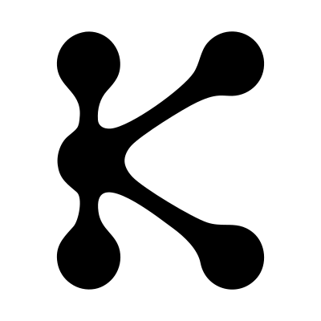

<p align="center">
  
</p>

<h1 align="center">konekt</h1>

[](https://www.npmjs.com/package/konekt)
[](https://www.npmjs.com/package/konekt-ui)
[](https://github.com/lsheva/konekt/actions/workflows/ci.yml)
[](./LICENSE)

A minimal, modular WalletConnect v2 provider for browser apps. ESM only, with no `@walletconnect`
runtime dependency. Chain adapters, features, and UI are separate imports so unused code can stay
out of the bundle.

Documentation: [lsheva.github.io/konekt](https://lsheva.github.io/konekt/)

```sh
pnpm add konekt
```

```ts
import { Provider } from "konekt";
import { evm } from "konekt/eip155";

const provider = await Provider.init({
  projectId,
  metadata: { name: "App", description: "My app", url: location.origin, icons: [] },
  chains: evm(1),
});

provider.on("display_uri", showPairingUri);
await provider.connect();
```

## Why konekt

The modern-browser EVM path is 14.53 kB minified and gzipped through the first encrypted message,
against 142.97 kB for the main bundle of `@walletconnect/ethereum-provider@2.23.10`. A matched Vite
React app first-loads 69.20 kB with Konekt, 204.25 kB with that official provider, and 781.00 kB with
AppKit. Konekt gets there by implementing the protocol directly, using Web Crypto before a polyfill,
and keeping chains, authentication, reads, and UI behind separate entry points. Reads go to a
transport you configure rather than a default public endpoint, and the wallet picker is your choice
rather than a bundled modal.

- [Why Konekt is better](https://lsheva.github.io/konekt/guides/why-konekt/) — the full comparison
  with the official provider and Reown AppKit
- [Migrating from `@walletconnect/ethereum-provider`](https://lsheva.github.io/konekt/guides/migrate-ethereum-provider/)

## Packages

| Package | What |
| --- | --- |
| [`konekt`](packages/konekt) | Provider, chain adapters, SIWE, CACAO, HTTP reads |
| [`konekt-ui`](packages/konekt-ui) | React wallet picker and pairing QR |
| [`docs`](packages/docs) | Guides and API reference |
| [`example`](packages/example) | Slim wagmi 3 app |
| [`showcase`](packages/showcase) | Capabilities lab |
| [`size-walletconnect`](packages/size-walletconnect) | Vite size fixture: official Ethereum Provider |
| [`size-appkit`](packages/size-appkit) | Vite size fixture: AppKit + ethers |
| [`size-konekt`](packages/size-konekt) | Vite size fixture: Konekt |
| [`size-konekt-ui`](packages/size-konekt-ui) | Vite size fixture: Konekt + UI |
| [`integrations`](packages/integrations) | Application-owned Solana and CosmJS bridges to copy |

Published packages are independently versioned. See [RELEASING.md](RELEASING.md).

## Develop

Requires Node 24 and pnpm 10.

```sh
pnpm install
pnpm dev              # example app
pnpm dev:showcase
pnpm dev:docs
pnpm test
pnpm check            # lint, tests, types, package and size checks
pnpm size:apps        # Vite app first-load vs overall comparison
```

See [CONTRIBUTING.md](CONTRIBUTING.md) before opening a pull request, and
[SECURITY.md](SECURITY.md) to report a vulnerability.

## License

[ISC](./LICENSE)
